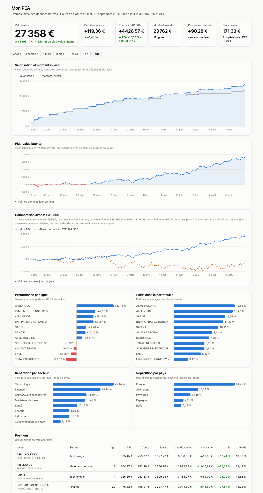
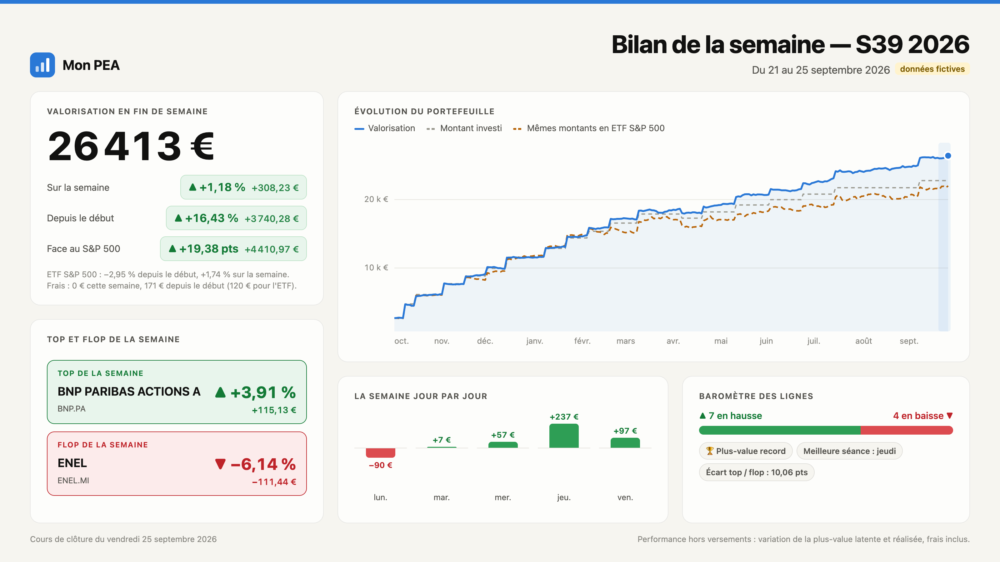

# gestion-pea

Suivi automatisé d'un PEA (Plan d'Épargne en Actions) à partir des avis d'opéré PDF de la banque.



*Aperçu avec des données fictives. Version interactive : [tableau_exemple.html](https://djenvert.github.io/gestion-pea/tableau_exemple.html).*

On dépose un avis dans `inbox/` : il est lu, vérifié puis enregistré dans une base SQLite. Les cours de clôture sont récupérés sur Yahoo Finance et un tableau de bord HTML autonome est régénéré. Tout tourne en local, sans dépendance à installer.

## Fonctionnalités

- **Import des avis d'opéré** (PDF) : achats au comptant sur Paris et achats en bourse étrangère, avec contrôle de cohérence des montants. Un avis incohérent est mis de côté dans `erreurs/` au lieu d'entrer en base.
- **Ordres provisoires** : un copier-coller du « suivi des ordres » du site de la banque, enregistré en `.txt`, crée une transaction provisoire. Elle est remplacée par l'avis PDF de même numéro d'ordre quand il arrive.
- **PRU frais inclus** : coût moyen pondéré, courtages, commissions et frais compris. Une vente laisse le PRU inchangé et cumule la plus-value réalisée.
- **Cours quotidiens** : clôtures récupérées sur Yahoo Finance. Le symbole et le secteur sont trouvés automatiquement à partir de l'ISIN.
- **Historique de valorisation** reconstruit jour par jour depuis les transactions.
- **Comparaison avec le S&P 500** : chaque achat ou vente est répliqué, pour le même montant net, sur un ETF S&P 500 éligible au PEA (Amundi PEA S&P 500, FR0011871128), commission de 0,50 % comprise et en parts fractionnaires. Le tableau de bord compare le gain total du PEA à celui de ce portefeuille témoin.
- **Tableau de bord** (`tableau.html`) : valorisation et montant investi, plus-value latente, performance et poids par ligne, répartition par secteur et par pays, positions, transactions, avec un bouton « Partager » qui copie le résumé d'une opération. Le fichier fonctionne hors ligne, gère le mode sombre et propose une version tableau de chaque graphique.
- **Bilan de la semaine** (`bilans/bilan_AAAA-Sss.png`) : une image à partager avec la valorisation, la performance de la semaine et depuis le début (hors versements), le top et le flop, la semaine jour par jour, l'écart avec un ETF S&P 500 acheté aux mêmes montants, les frais payés (comparés à ceux de l'ETF), le nombre de lignes en hausse et en baisse, et les faits marquants (record de plus-value, série de semaines positives). Le bilan est généré chaque semaine au jour et à l'heure choisis, avec une notification macOS.
- **Automatisation macOS** avec launchd : import dès qu'un fichier arrive dans `inbox/`, mise à jour des cours en semaine à 18h30.

## Bilan de la semaine



La performance de la semaine est la variation de la plus-value totale (latente + réalisée) : un achat fait dans la semaine n'est pas compté comme un gain. Le top et le flop comparent la dernière clôture de la semaine à celle de la semaine précédente, ou au prix d'achat pour une ligne entrée dans la semaine.

## Prérequis

- Python 3.10 ou plus récent (bibliothèque standard uniquement)
- `pdftotext`, fourni par poppler : `brew install poppler`
- Un accès réseau pour les cours (Yahoo Finance)
- Google Chrome ou Chromium pour rendre le bilan de la semaine en PNG

Le parseur a été écrit pour les avis d'opéré de Société Générale. Les avis d'une autre banque demanderont d'adapter `parser_avis.py`.

## Utilisation

```sh
git clone https://github.com/djenvert/gestion-pea.git
cd gestion-pea

# Déposer un ou plusieurs avis dans inbox/, puis :
python3 pea.py traiter      # importe inbox/ et archive dans outbox/AAAA-MM/ (ou erreurs/)
python3 pea.py cours        # récupère les clôtures manquantes, met à jour l'historique et le tableau
python3 pea.py recalculer   # reconstruit positions et historique depuis les transactions
python3 pea.py tableau      # régénère seulement tableau.html
python3 pea.py bilan        # met à jour les cours, puis crée le bilan de la semaine en PNG
python3 pea.py bilan 2026-09-25        # bilan d'une semaine passée (sans mise à jour des cours)
python3 pea.py planifier-bilan vendredi 19:00   # bilan automatique chaque semaine
python3 pea.py planifier-bilan aucun            # arrêter le bilan automatique

open tableau.html
```

Pour voir le rendu sans aucune donnée personnelle, `python3 exemple.py` génère `tableau_exemple.html` et `bilan_exemple.png`. Il porte sur un portefeuille fictif de 11 valeurs européennes : les sociétés sont réelles, mais les opérations et les cours sont inventés.

La base `pea.db` est créée au premier lancement. Le journal est écrit dans `logs/pea.log`.

L'ordre de dépôt des avis n'a pas d'importance : les positions et l'historique sont recalculés intégralement, dans l'ordre chronologique, à chaque passage. Un même avis déposé deux fois est ignoré.

Pour voir comment un nouvel avis est mis en page avant d'adapter le parseur :

```sh
pdftotext -layout avis.pdf -
```

## Automatisation (macOS)

Deux agents launchd, à placer dans `~/Library/LaunchAgents/`. Ils tournent avec un PATH minimal : utiliser des chemins absolus.

Import automatique au dépôt d'un fichier (`com.exemple.gestion-pea.plist`) :

```xml
<?xml version="1.0" encoding="UTF-8"?>
<!DOCTYPE plist PUBLIC "-//Apple//DTD PLIST 1.0//EN" "http://www.apple.com/DTDs/PropertyList-1.0.dtd">
<plist version="1.0">
<dict>
  <key>Label</key>
  <string>com.exemple.gestion-pea</string>
  <key>ProgramArguments</key>
  <array>
    <string>/opt/homebrew/bin/python3</string>
    <string>/chemin/vers/gestion-pea/pea.py</string>
    <string>traiter</string>
  </array>
  <key>WorkingDirectory</key>
  <string>/chemin/vers/gestion-pea</string>
  <key>WatchPaths</key>
  <array>
    <string>/chemin/vers/gestion-pea/inbox</string>
  </array>
  <key>ThrottleInterval</key>
  <integer>10</integer>
  <key>StandardOutPath</key>
  <string>/Users/vous/Library/Logs/gestion-pea-launchd.log</string>
  <key>StandardErrorPath</key>
  <string>/Users/vous/Library/Logs/gestion-pea-launchd.log</string>
</dict>
</plist>
```

Pour les cours, un second agent identique avec l'argument `cours` et, à la place de `WatchPaths`, une clé `StartCalendarInterval` pour chaque jour de 1 à 5 (`Weekday`) à 18h30 (`Hour` 18, `Minute` 30).

```sh
launchctl load ~/Library/LaunchAgents/com.exemple.gestion-pea.plist
```

Un verrou (`.pea.lock`) empêche deux traitements de tourner en même temps.

## Organisation du code

| Fichier | Rôle |
| --- | --- |
| `pea.py` | Point d'entrée : commandes, gestion de l'inbox, verrou, journal |
| `parser_avis.py` | Lecture et vérification des avis PDF et des ordres `.txt` |
| `db.py` | Schéma SQLite, insertion, calcul des positions, du PRU et de l'historique |
| `cours_yahoo.py` | Recherche du symbole par ISIN et clôtures quotidiennes sur Yahoo Finance |
| `tableau.py` | Génère `tableau.html` en injectant les données dans le modèle |
| `tableau_modele.html` | Modèle du tableau de bord (HTML, SVG et JavaScript natifs) |
| `bilan.py`, `bilan_modele.html` | Bilan de la semaine : calculs, puis rendu PNG par Chrome headless |
| `exemple.py` | Génère `tableau_exemple.html` et `bilan_exemple.png` avec des données fictives |
| `tests/` | Tests unitaires |

La table `transactions` est la seule source de vérité. Les tables `valeurs` (positions, PRU) et `historique` (valorisation quotidienne) en sont dérivées et reconstruites à chaque passage.

## Tests

```sh
python3 -m unittest tests/test_parser.py tests/test_anonymat.py tests/test_bilan.py tests/test_etf.py
```

Les tests utilisent une base SQLite en mémoire et ne touchent jamais `pea.db`.

Les avis de `tests/fixtures/` sont de vrais avis anonymisés. Seul leur texte extrait par `pdftotext -layout` est conservé, et `tests/anonymiser.py` y remplace le titulaire, l'adresse, l'agence, les numéros de compte, les codes-barres et la référence d'ordre. Les montants, quantités et dates ne changent pas, et la largeur des champs est conservée, car le parseur lit les montants par position de colonne. Le script vérifie que l'avis anonymisé se lit exactement comme l'original.

```sh
python3 tests/anonymiser.py chemin/vers/AvisOperation_XXX.pdf   # écrit le .txt anonymisé à côté
```

`tests/test_anonymat.py` sert de garde-fou avant publication. Il vérifie la structure des fixtures et l'absence de PDF publiable. Si le fichier local `tests/interdits.txt` existe, il cherche aussi dans tous les fichiers publiables chacune des chaînes qu'il contient (nom, rue, numéros de compte…), une par ligne. Ce fichier est exclu par le `.gitignore`.

## Données personnelles

Le dépôt ne contient aucune donnée de portefeuille. Le `.gitignore` exclut la base, les avis (`inbox/`, `outbox/`, `erreurs/`), les journaux, le tableau généré et les PDF de test. Vérifiez `git status` avant chaque commit.

## À faire

- **Ventes** : le parseur prévoit les variantes VENTE, mais aucun vrai avis de vente n'a encore été traité. Le premier servira à valider la lecture et le calcul de la plus-value réalisée.
- **Dividendes** : les avis de versement de dividendes ne sont pas encore gérés.

## Limites

- Frais de tenue de compte et opérations sur titres ne sont pas gérés.
- L'API de Yahoo Finance n'est pas officielle et peut changer sans préavis.

Ce projet est un outil personnel de suivi et ne constitue pas un conseil en investissement.

## Licence

Distribué sous licence MIT : voir [LICENSE](LICENSE).
